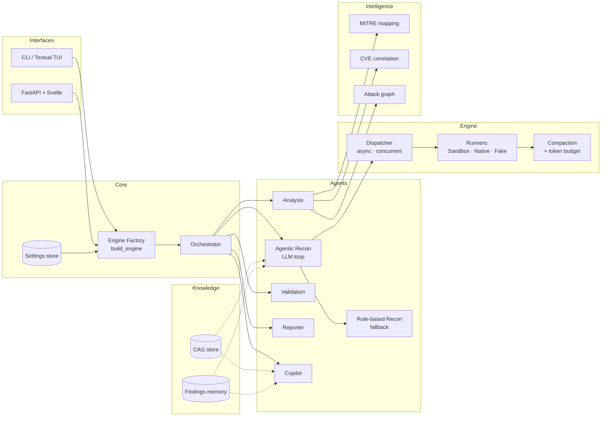
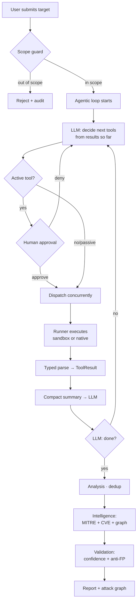
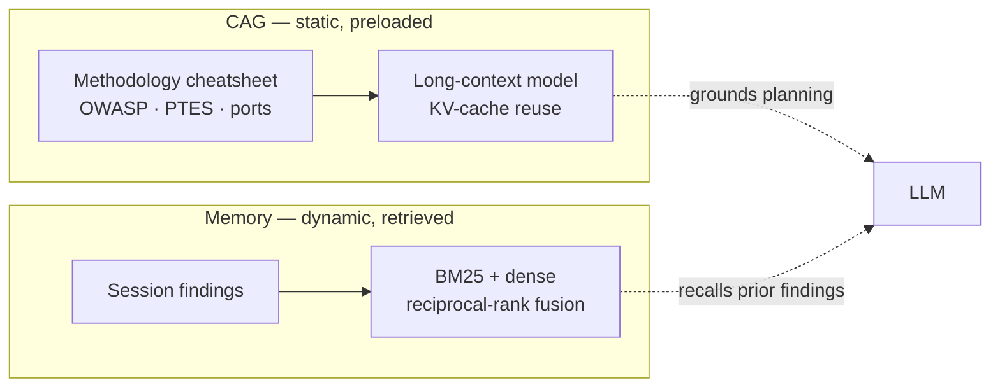
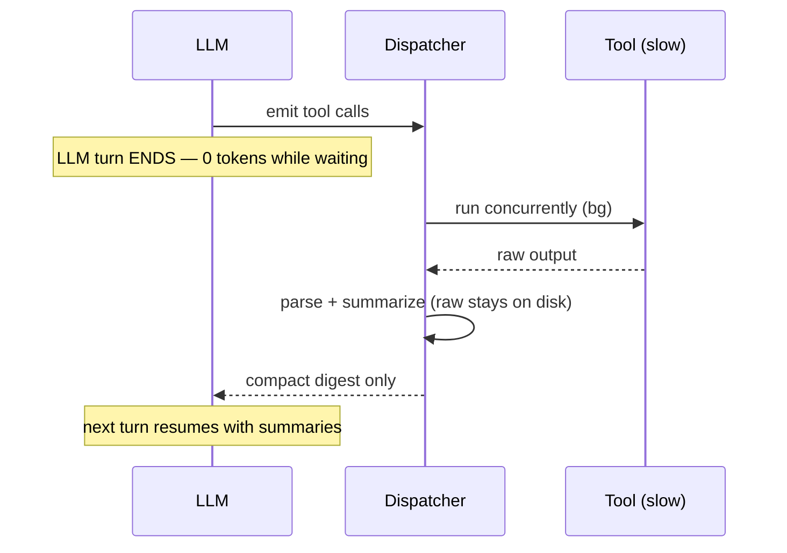
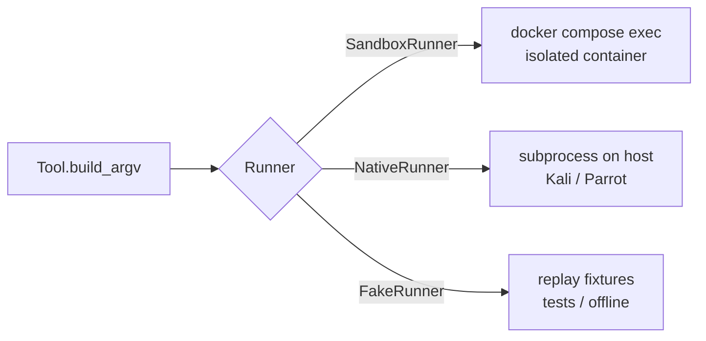
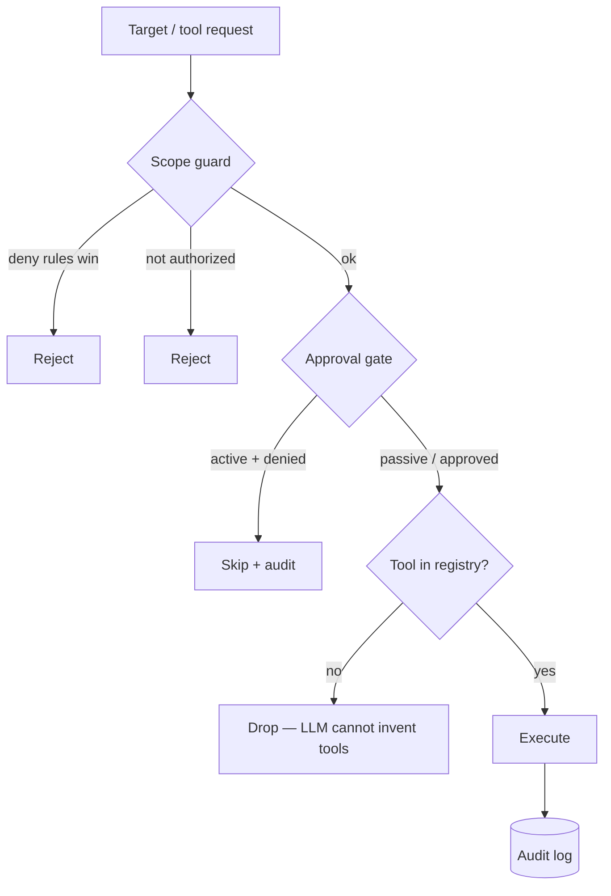

# HuntAI — Architecture

This document explains how HuntAI is put together: the components, how a request
flows through them, and the design decisions behind the structure.

## Design principles

1. **The LLM orchestrates, code enforces.** The model decides *what* recon to do;
   scope, approval, and execution are enforced by code the model cannot bypass.
2. **Everything typed.** Data crossing any boundary (tool → agent → UI) is a
   Pydantic model. No free-text scraping.
3. **Token discipline.** The LLM never blocks on a slow tool and never sees raw
   tool dumps — only compacted summaries.
4. **One core, many faces.** CLI, Web, and TUI all call the same engine factory.
5. **Safe by construction.** A target that fails the scope guard can never reach a tool.

---

## Component map

---

## Request lifecycle (Auto mode)

Key property: the loop is bounded by a **max-iteration cap** and a **token
budget**. If the LLM is unavailable, the very first decision falls back to a
deterministic rule-based plan, so the system always makes progress.

---

## The knowledge split (CAG vs memory)

The original project conflated RAG and CAG. HuntAI keeps them **separate** and
uses each for what it's good at:

- **CAG** — a bounded, stable cheatsheet preloaded once and reused (no retrieval).
  Right for knowledge that doesn't change mid-engagement.
- **Memory** — dynamic per-session findings, retrieved on demand with hybrid search.
  Right for the growing, query-dependent knowledge.

---

## Token-discipline engine

Slow tools (an `nmap` can take minutes) must not burn tokens.

- Tools run **detached** from the LLM turn.
- Results are **parsed and summarized** before feedback — raw output is never re-sent.
- Multiple finished tools are **batched** into one LLM call.
- A `TokenBudget` charges summaries (not raw) and caps total spend.

---

## Runners: same tools, different execution

The agent, scope guard, and parsers are identical across runners — only *where*
the tool executes changes. This is why the same code runs in a Docker sandbox on
Windows and natively on a Kali box.

---

## Model routing

`config.Settings.route(role)` maps a role to a free provider, with fallback:

| Role | Primary | Fallback |
|------|---------|----------|
| Reasoning / orchestration | NVIDIA NIM | Ollama (local) |
| Long-context (CAG) | Gemini | Ollama |
| Parsing (high volume) | Ollama | — |
| Embeddings | Ollama (`bge-m3`) | — |

All three providers are OpenAI-compatible, so a single `openai`-SDK client drives
them. Set `prefer_offline` to route everything to Ollama — no cloud, no keys.

---

## Safety enforcement points

Four independent checks, all in code: scope → approval → registry validation →
audit. The LLM participates in *planning* but sits inside these rails.
