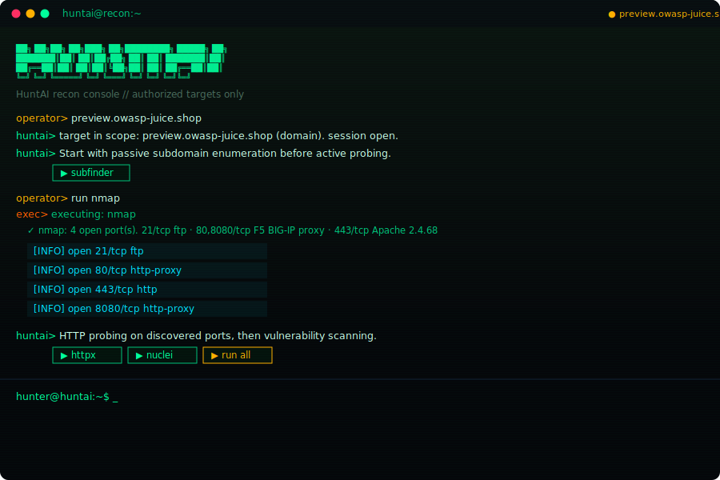
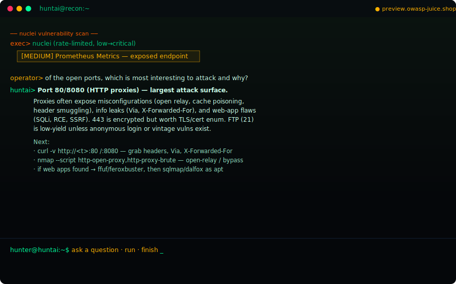
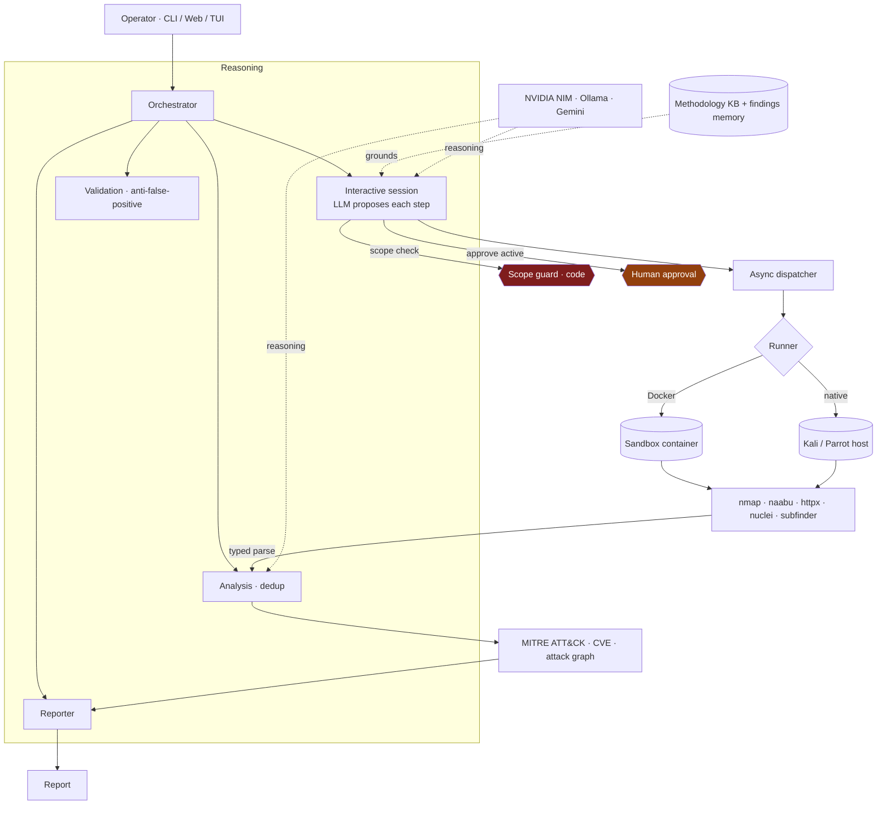
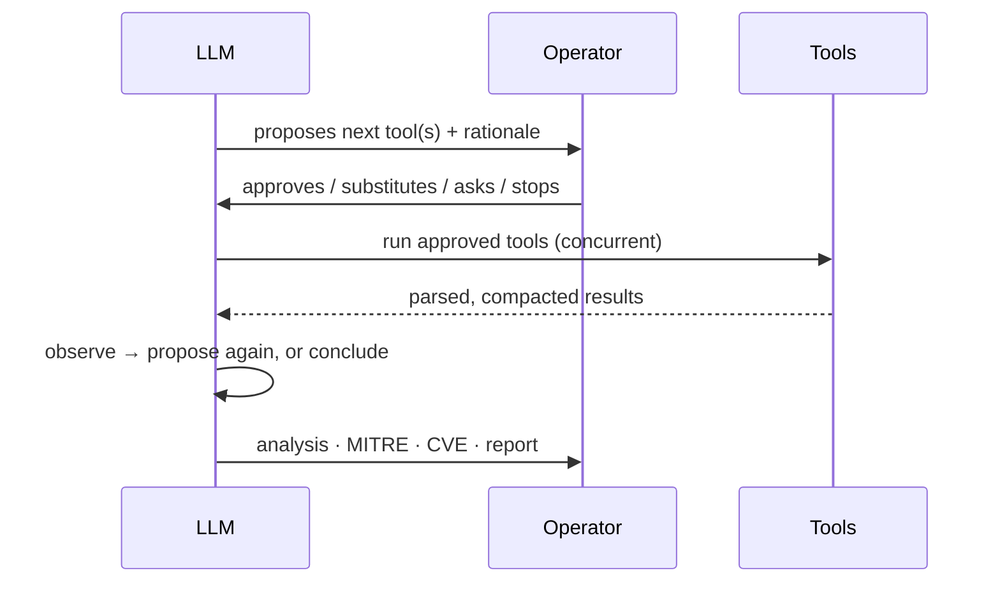

# HuntAI

A reconnaissance framework in which a large language model plans and adapts the
engagement, while a human authorizes each active step. HuntAI treats
reconnaissance as an interactive dialogue between an operator and a model —
the model reasons over tool output and proposes the next action; the operator
decides what actually runs. Findings are correlated to MITRE ATT&CK techniques
and known CVEs and assembled into a structured report.

The system runs entirely on freely available models (NVIDIA NIM, Ollama, or
Gemini) and is constrained, in code, to targets the operator is authorized to
assess.

<p align="center">
  
</p>

---

## Motivation

Reconnaissance is repetitive and tool-heavy, yet it demands judgement: which
tool to run next depends on what the previous one revealed, and aggressive
automation risks both false positives and disruption to the target. Fully
autonomous "AI pentesters" tend toward the latter — they run everything and
reason afterwards.

HuntAI takes the opposite stance. The model acts as an *analyst that proposes*,
not an agent that executes. Each step is a suggestion with a rationale; nothing
touches the target until the operator approves it. This keeps a human in the
decision loop — the point at which legal and ethical responsibility actually
sits — while still using the model to remove the tedium of remembering tool
order, parsing output, and mapping results to frameworks.

## Approach

Three design commitments follow from that stance:

1. **The model plans; code enforces.** The LLM chooses *which* recon to propose.
   Scope, approval, and execution are enforced by code the model cannot
   circumvent. A proposal referencing an unknown tool, or a target outside
   scope, is rejected before anything runs.
2. **Interaction over autonomy.** Recon proceeds as `propose → approve → run →
   observe → propose`. The operator can accept a proposal, substitute their own
   tool, ask a question, or stop.
3. **Typed throughout.** Tool output is parsed into typed records rather than
   scraped from free text, so results feed analysis deterministically and the
   model is shown compact summaries rather than raw dumps.

<p align="center">
  
</p>

## Architecture



A fuller treatment of each component — the dispatcher's token discipline, the
separation of preloaded knowledge from retrieved findings, and the runner
abstraction — is in [ARCHITECTURE.md](ARCHITECTURE.md).

## The interaction loop



The model never blocks on a slow tool: a proposal ends its turn, tools run
detached, and the model resumes with a summary. Only tool names present in the
registry are executed, so the model can shape the engagement but cannot
introduce an arbitrary command.

## Scope and safety

HuntAI is intended for authorized assessment and security education only.

- A **scope guard** validates every target in code before any tool runs. The
  lab network and localhost are permitted by default; public addresses are
  denied unless explicitly authorized; cloud-metadata and CGNAT ranges are
  denied unconditionally.
- Adding a target requires an explicit authorization acknowledgement, which is
  recorded to an append-only audit log alongside every scope decision, approval,
  and tool execution.
- Active tools require operator approval; passive collection runs first.

## Getting started

```bash
git clone https://github.com/sachindots/HuntAI.git && cd HuntAI
python -m venv .venv && source .venv/bin/activate     # Windows: .venv\Scripts\activate
pip install -e ".[dev,web,llm]"
pytest                                                 # test suite

huntai check 172.20.0.5                                # in scope
huntai check 8.8.8.8                                   # denied
huntai serve                                           # web console at :8000
```

Models are configured from the app (`huntai config set nvidia_api_key …`) or a
`.env` file; set `HUNTAI_PREFER_OFFLINE=true` to run entirely on local Ollama.

### Configuring scope

The simplest way to point HuntAI at systems you are authorized to test is the
`HUNTAI_ALLOWED_TARGETS` variable in `.env` — a comma-separated list of IPs,
CIDRs, hostnames, or URLs:

```bash
HUNTAI_ALLOWED_TARGETS="203.0.113.7, 10.0.0.0/24, app.example.com, https://demo.example.com"
```

Equivalently, `huntai scope add <target> --yes` records an authorization from
the CLI, and the web console has the same control. Lab defaults live in
`scope.yaml`. Details of running against Docker labs or natively on a Kali
host are in [RUN.md](RUN.md).

## Evaluation

An evaluation harness runs an assessment against a target with a known answer
key and reports coverage (recall over expected findings), precision over
report-worthy findings, and F1 — providing a falsifiable measure of the
pipeline rather than an anecdotal one.

## Repository layout

```
src/huntai/
├── agents/       orchestration, interactive session, analysis, validation, reporter
├── analysis/     MITRE mapping, CVE correlation, attack-graph construction
├── engine/       async dispatcher, runners (sandbox / native / replay), compaction
├── tools/        typed tool wrappers and output parsers
├── kb/           preloaded methodology (CAG) and findings memory
├── llm/          openai-SDK client and provider routing
├── core/         engine factory, scope loader, settings store
├── web/          FastAPI service and console
├── evalkit/      benchmark harness
└── obs/          span tracing
```

## License

MIT — see [LICENSE](LICENSE).
